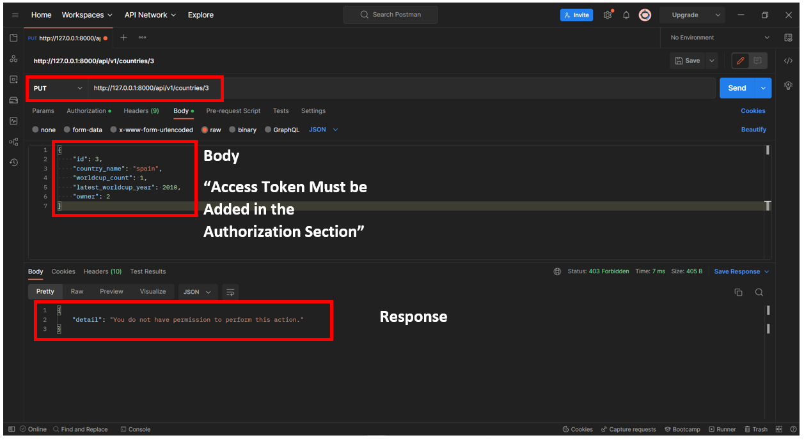

# drf-auth

## Project: 

World Cup Countries REST API

## Author(s): 

Yazan Alfarra

## Project Description

This is a REST API where you can send GET, POST, PUT, PATCH and DELETE HTTP requests, to get, update or delete books and authors details. It needs authentication using JWT.

## Login

- **Docker Super User:** admin
- **Password:** 0000

- **Docker Normal User:** normal

- **Password:** u?HeGi*w79ibU$S

## Getting Started

1. Getting the Access and the Refresh Tokens


2. Expired Token Response


3. Get a new Access Token Using the Refresh Token


4. GET request to fetch all the data


5. GET request to fetch a specific data


6. PUT request to a data that does not belong to you



## Installing the requirements

```
pip install -r requirements.txt
```

## Running the server

```
python manage.py runserver
```
 